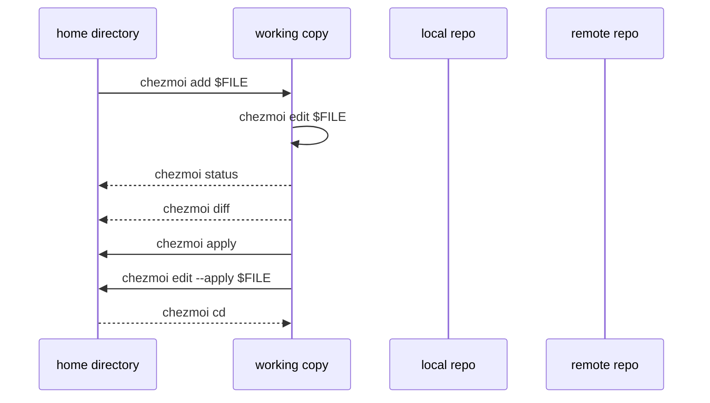
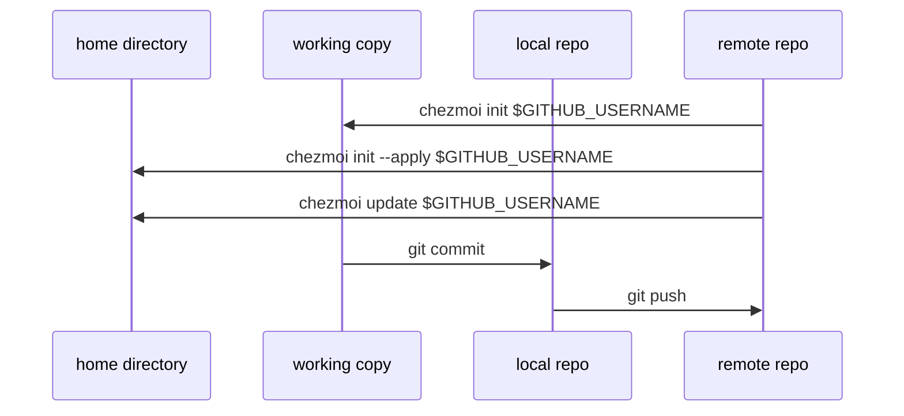

# Command overview

## Getting started

- [`chezmoi doctor`](/reference/commands/doctor.md) checks for common problems.
  If you encounter something unexpected, run this first.

- [`chezmoi init`](/reference/commands/init.md) creates chezmoi's source
  directory and a git repo on a new machine.

## Daily commands

- [`chezmoi add $FILE`](/reference/commands/add.md) adds `$FILE`from your home
  directory to the source directory.

- [`chezmoi edit $FILE`](/reference/commands/edit.md) opens your editor with
  the file in the source directory that corresponds to `$FILE`.

- [`chezmoi status`](/reference/commands/status.md) gives a quick summary of
  what files would change if you ran `chezmoi apply`.

- [`chezmoi diff`](/reference/commands/diff.md) shows the changes that
  `chezmoi apply` would make to your home directory.

- [`chezmoi apply`](/reference/commands/apply.md) updates your dotfiles from
  the source directory.

- [`chezmoi edit --apply $FILE`](/reference/commands/edit.md) is like
  `chezmoi
  edit $FILE` but also runs `chezmoi apply $FILE` afterwards.

- [`chezmoi cd`](/reference/commands/cd.md) opens a subshell in the source
  directory.

## Using chezmoi across multiple machines

- [`chezmoi init $GITHUB_USERNAME`](/reference/commands/init.md) clones your
  dotfiles from GitHub into the source directory.

- [`chezmoi init --apply $GITHUB_USERNAME`](/reference/commands/init.md) clones
  your dotfiles from GitHub into the source directory and runs
  `chezmoi
  apply`.

- [`chezmoi update`](/reference/commands/update.md) pulls the latest changes
  from your remote repo and runs `chezmoi apply`.

- Use normal git commands to add, commit, and push changes to your remote repo.

## Working with templates

- [`chezmoi data`](/reference/commands/data.md) prints the available template
  data.

- [`chezmoi add --template $FILE`](/reference/commands/add.md) adds `$FILE` as
  a template.

- [`chezmoi chattr +template $FILE`](/reference/commands/chattr.md) makes an
  existing file a template.

- [`chezmoi cat $FILE`](/reference/commands/cat.md) prints the target contents
  of `$FILE`, without changing `$FILE`.

- [`chezmoi execute-template`](/reference/commands/execute-template.md) is
  useful for testing and debugging templates.
