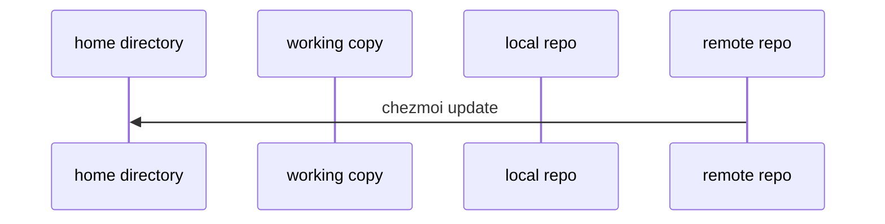
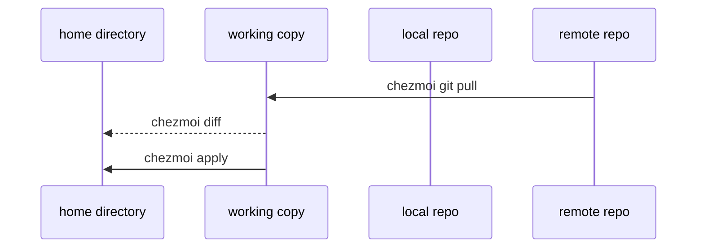
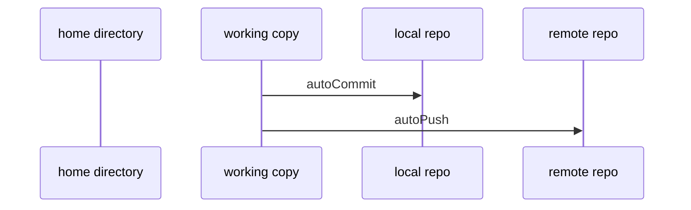

# Daily operations

## Pull the latest changes from your repo and apply them

You can pull the changes from your repo and apply them in a single command:

```console
$ chezmoi update
```

This runs `git pull --autostash --rebase` in your source directory and then
`chezmoi apply`.



## Changing something and sending it to your repo

You can make edits to the source directory, but more likely you'll be tweaking things in your $HOME directly and then want to persist the results:

```console
# Assuming you have `.gitignore` already managed by chezmoi
echo "# My Addition" >> .gitignore_global

# Doing [`chezmoi update`](../reference/commands/update.md) will lose your changes (!), you need to [`re-add`](../reference/commands/re-add.md)
chezmoi re-add .gitignore_global

# Then if you don't have `autoPush` configured you'll have to do the [`git`](../reference/commands/git.md) part yourself
chezmoi git commit -- -a -m "Did a change"
chezmoi git push
```

## Pull the latest changes from your repo and see what would change, without actually applying the changes

Run:

```console
$ chezmoi git pull -- --autostash --rebase && chezmoi diff
```

This runs `git pull --autostash --rebase` in your source directory and `chezmoi
diff` then shows the difference between the target state computed from your
source directory and the actual state.

If you're happy with the changes, then you can run

```console
$ chezmoi apply
```

to apply them.



## Automatically commit and push changes to your repo

chezmoi can automatically commit and push changes to your source directory to
your repo. This feature is disabled by default. To enable it, add the following
to your config file:

```toml title="~/.config/chezmoi/chezmoi.toml"
[git]
    autoCommit = true
    autoPush = true
```

Whenever a change is made to your source directory, chezmoi will commit the
changes with an automatically-generated commit message (if `autoCommit` is true)
and push them to your repo (if `autoPush` is true). `autoPush` implies
`autoCommit`, i.e. if `autoPush` is true then chezmoi will auto-commit your
changes. If you only set `autoCommit` to true then changes will be committed but
not pushed.

By default, `autoCommit` will generate a commit message based on the files
changed. You can override this by setting the `git.commitMessageTemplate`
configuration variable. For example, to have chezmoi prompt you for a commit
message each time, use:

```toml title="~/.config/chezmoi/chezmoi.toml"
[git]
    autoCommit = true
    commitMessageTemplate = "{{ promptString \"Commit message\" }}"
```

If your commit message is longer than fits in a string then you can set
`git.commitMessageTemplateFile` to specify a path to the commit message template
relative to the source directory, for example:

```toml title="~/.config/chezmoi/chezmoi.toml"
[git]
    autoCommit = true
    commitMessageTemplateFile = ".commit_message.tmpl"
```

Be careful when using `autoPush`. If your dotfiles repo is public and you
accidentally add a secret in plain text, that secret will be pushed to your
public repo.



## Install chezmoi and your dotfiles on a new machine with a single command

chezmoi's install script can run `chezmoi init` for you by passing extra
arguments to the newly installed chezmoi binary. If your dotfiles repo is
`github.com/$GITHUB_USERNAME/dotfiles` then installing chezmoi, running
`chezmoi init`, and running `chezmoi apply` can be done in a single line of
shell:

```console
$ sh -c "$(curl -fsLS get.chezmoi.io)" -- init --apply $GITHUB_USERNAME
```

If your dotfiles repo has a different name to `dotfiles`, or if you host your
dotfiles on a different service, then see the [reference manual for `chezmoi
init`](../reference/commands/init.md).

For setting up transitory environments (e.g. short-lived Linux containers) you
can install chezmoi, install your dotfiles, and then remove all traces of
chezmoi, including the source directory and chezmoi's configuration directory,
with a single command:

```console
$ sh -c "$(curl -fsLS get.chezmoi.io)" -- init --one-shot $GITHUB_USERNAME
```
