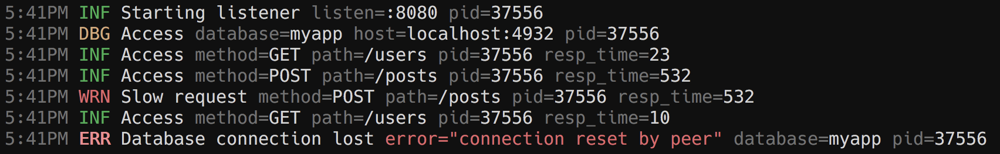

# Zero Allocation JSON Logger

[](https://godoc.org/github.com/rs/zerolog) [](https://raw.githubusercontent.com/rs/zerolog/master/LICENSE) [](https://travis-ci.org/rs/zerolog) [](http://gocover.io/github.com/rs/zerolog)

The zerolog package provides a fast and simple logger dedicated to JSON output.

Zerolog's API is designed to provide both a great developer experience and stunning [performance](#benchmarks). Its unique chaining API allows zerolog to write JSON (or CBOR) log events by avoiding allocations and reflection.

Uber's [zap](https://godoc.org/go.uber.org/zap) library pioneered this approach. Zerolog is taking this concept to the next level with a simpler to use API and even better performance.

To keep the code base and the API simple, zerolog focuses on efficient structured logging only. Pretty logging on the console is made possible using the provided (but inefficient) [`zerolog.ConsoleWriter`](#pretty-logging).



## Who uses zerolog

Find out [who uses zerolog](https://github.com/rs/zerolog/wiki/Who-uses-zerolog) and add your company / project to the list.

## Features

* [Blazing fast](#benchmarks)
* [Low to zero allocation](#benchmarks)
* [Leveled logging](#leveled-logging)
* [Sampling](#log-sampling)
* [Hooks](#hooks)
* [Contextual fields](#contextual-logging)
* [`context.Context` integration](#contextcontext-integration)
* [Integration with `net/http`](#integration-with-nethttp)
* [JSON and CBOR encoding formats](#binary-encoding)
* [Pretty logging for development](#pretty-logging)
* [Error Logging (with optional Stacktrace)](#error-logging)

## Installation

```bash
go get -u github.com/rs/zerolog/log
```

## Getting Started

### Simple Logging Example

For simple logging, import the global logger package **github.com/rs/zerolog/log**

```go
package main

import (
    "github.com/rs/zerolog"
    "github.com/rs/zerolog/log"
)

func main() {
    // UNIX Time is faster and smaller than most timestamps
    zerolog.TimeFieldFormat = zerolog.TimeFormatUnix

    log.Print("hello world")
}

// Output: {"time":1516134303,"level":"debug","message":"hello world"}
```
> Note: By default log writes to `os.Stderr`
> Note: The default log level for `log.Print` is *debug*

### Contextual Logging

**zerolog** allows data to be added to log messages in the form of key:value pairs. The data added to the message adds "context" about the log event that can be critical for debugging as well as myriad other purposes. An example of this is below:

```go
package main

import (
    "github.com/rs/zerolog"
    "github.com/rs/zerolog/log"
)

func main() {
    zerolog.TimeFieldFormat = zerolog.TimeFormatUnix

    log.Debug().
        Str("Scale", "833 cents").
        Float64("Interval", 833.09).
        Msg("Fibonacci is everywhere")
    
    log.Debug().
        Str("Name", "Tom").
        Send()
}

// Output: {"level":"debug","Scale":"833 cents","Interval":833.09,"time":1562212768,"message":"Fibonacci is everywhere"}
// Output: {"level":"debug","Name":"Tom","time":1562212768}
```

> You'll note in the above example that when adding contextual fields, the fields are strongly typed. You can find the full list of supported fields [here](#standard-types)

### Leveled Logging

#### Simple Leveled Logging Example

```go
package main

import (
    "github.com/rs/zerolog"
    "github.com/rs/zerolog/log"
)

func main() {
    zerolog.TimeFieldFormat = zerolog.TimeFormatUnix

    log.Info().Msg("hello world")
}

// Output: {"time":1516134303,"level":"info","message":"hello world"}
```

> It is very important to note that when using the **zerolog** chaining API, as shown above (`log.Info().Msg("hello world"`), the chain must have either the `Msg` or `Msgf` method call. If you forget to add either of these, the log will not occur and there is no compile time error to alert you of this.

**zerolog** allows for logging at the following levels (from highest to lowest):

* panic (`zerolog.PanicLevel`, 5)
* fatal (`zerolog.FatalLevel`, 4)
* error (`zerolog.ErrorLevel`, 3)
* warn (`zerolog.WarnLevel`, 2)
* info (`zerolog.InfoLevel`, 1)
* debug (`zerolog.DebugLevel`, 0)
* trace (`zerolog.TraceLevel`, -1)

You can set the Global logging level to any of these options using the `SetGlobalLevel` function in the zerolog package, passing in one of the given constants above, e.g. `zerolog.InfoLevel` would be the "info" level.  Whichever level is chosen, all logs with a level greater than or equal to that level will be written. To turn off logging entirely, pass the `zerolog.Disabled` constant.

#### Setting Global Log Level

This example uses command-line flags to demonstrate various outputs depending on the chosen log level.

```go
package main

import (
    "flag"

    "github.com/rs/zerolog"
    "github.com/rs/zerolog/log"
)

func main() {
    zerolog.TimeFieldFormat = zerolog.TimeFormatUnix
    debug := flag.Bool("debug", false, "sets log level to debug")

    flag.Parse()

    // Default level for this example is info, unless debug flag is present
    zerolog.SetGlobalLevel(zerolog.InfoLevel)
    if *debug {
        zerolog.SetGlobalLevel(zerolog.DebugLevel)
    }

    log.Debug().Msg("This message appears only when log level set to Debug")
    log.Info().Msg("This message appears when log level set to Debug or Info")

    if e := log.Debug(); e.Enabled() {
        // Compute log output only if enabled.
        value := "bar"
        e.Str("foo", value).Msg("some debug message")
    }
}
```

Info Output (no flag)

```bash
$ ./logLevelExample
{"time":1516387492,"level":"info","message":"This message appears when log level set to Debug or Info"}
```

Debug Output (debug flag set)

```bash
$ ./logLevelExample -debug
{"time":1516387573,"level":"debug","message":"This message appears only when log level set to Debug"}
{"time":1516387573,"level":"info","message":"This message appears when log level set to Debug or Info"}
{"time":1516387573,"level":"debug","foo":"bar","message":"some debug message"}
```

#### Logging without Level or Message

You may choose to log without a specific level by using the `Log` method. You may also write without a message by setting an empty string in the `msg string` parameter of the `Msg` method. Both are demonstrated in the example below.

```go
package main

import (
    "github.com/rs/zerolog"
    "github.com/rs/zerolog/log"
)

func main() {
    zerolog.TimeFieldFormat = zerolog.TimeFormatUnix

    log.Log().
        Str("foo", "bar").
        Msg("")
}

// Output: {"time":1494567715,"foo":"bar"}
```

### Error Logging

You can log errors using the `Err` method

```go
package main

import (
	"errors"

	"github.com/rs/zerolog"
	"github.com/rs/zerolog/log"
)

func main() {
	zerolog.TimeFieldFormat = zerolog.TimeFormatUnix

	err := errors.New("seems we have an error here")
	log.Error().Err(err).Msg("")
}

// Output: {"level":"error","error":"seems we have an error here","time":1609085256}
```

> The default field name for errors is `error`, you can change this by setting `zerolog.ErrorFieldName` to meet your needs.

#### Error Logging with Stacktrace

Using `github.com/pkg/errors`, you can add a formatted stacktrace to your errors. 

```go
package main

import (
	"github.com/pkg/errors"
	"github.com/rs/zerolog/pkgerrors"

	"github.com/rs/zerolog"
	"github.com/rs/zerolog/log"
)

func main() {
	zerolog.TimeFieldFormat = zerolog.TimeFormatUnix
	zerolog.ErrorStackMarshaler = pkgerrors.MarshalStack

	err := outer()
	log.Error().Stack().Err(err).Msg("")
}

func inner() error {
	return errors.New("seems we have an error here")
}

func middle() error {
	err := inner()
	if err != nil {
		return err
	}
	return nil
}

func outer() error {
	err := middle()
	if err != nil {
		return err
	}
	return nil
}

// Output: {"level":"error","stack":[{"func":"inner","line":"20","source":"errors.go"},{"func":"middle","line":"24","source":"errors.go"},{"func":"outer","line":"32","source":"errors.go"},{"func":"main","line":"15","source":"errors.go"},{"func":"main","line":"204","source":"proc.go"},{"func":"goexit","line":"1374","source":"asm_amd64.s"}],"error":"seems we have an error here","time":1609086683}
```

> zerolog.ErrorStackMarshaler must be set in order for the stack to output anything.

#### Logging Fatal Messages

```go
package main

import (
    "errors"

    "github.com/rs/zerolog"
    "github.com/rs/zerolog/log"
)

func main() {
    err := errors.New("A repo man spends his life getting into tense situations")
    service := "myservice"

    zerolog.TimeFieldFormat = zerolog.TimeFormatUnix

    log.Fatal().
        Err(err).
        Str("service", service).
        Msgf("Cannot start %s", service)
}

// Output: {"time":1516133263,"level":"fatal","error":"A repo man spends his life getting into tense situations","service":"myservice","message":"Cannot start myservice"}
//         exit status 1
```

> NOTE: Using `Msgf` generates one allocation even when the logger is disabled.


### Create logger instance to manage different outputs

```go
logger := zerolog.New(os.Stderr).With().Timestamp().Logger()

logger.Info().Str("foo", "bar").Msg("hello world")

// Output: {"level":"info","time":1494567715,"message":"hello world","foo":"bar"}
```

### Sub-loggers let you chain loggers with additional context

```go
sublogger := log.With().
                 Str("component", "foo").
                 Logger()
sublogger.Info().Msg("hello world")

// Output: {"level":"info","time":1494567715,"message":"hello world","component":"foo"}
```

### Pretty logging

To log a human-friendly, colorized output, use `zerolog.ConsoleWriter`:

```go
log.Logger = log.Output(zerolog.ConsoleWriter{Out: os.Stderr})

log.Info().Str("foo", "bar").Msg("Hello world")

// Output: 3:04PM INF Hello World foo=bar
```

To customize the configuration and formatting:

```go
output := zerolog.ConsoleWriter{Out: os.Stdout, TimeFormat: time.RFC3339}
output.FormatLevel = func(i interface{}) string {
    return strings.ToUpper(fmt.Sprintf("| %-6s|", i))
}
output.FormatMessage = func(i interface{}) string {
    return fmt.Sprintf("***%s****", i)
}
output.FormatFieldName = func(i interface{}) string {
    return fmt.Sprintf("%s:", i)
}
output.FormatFieldValue = func(i interface{}) string {
    return strings.ToUpper(fmt.Sprintf("%s", i))
}

log := zerolog.New(output).With().Timestamp().Logger()

log.Info().Str("foo", "bar").Msg("Hello World")

// Output: 2006-01-02T15:04:05Z07:00 | INFO  | ***Hello World**** foo:BAR
```

### Sub dictionary

```go
log.Info().
    Str("foo", "bar").
    Dict("dict", zerolog.Dict().
        Str("bar", "baz").
        Int("n", 1),
    ).Msg("hello world")

// Output: {"level":"info","time":1494567715,"foo":"bar","dict":{"bar":"baz","n":1},"message":"hello world"}
```

### Customize automatic field names

```go
zerolog.TimestampFieldName = "t"
zerolog.LevelFieldName = "l"
zerolog.MessageFieldName = "m"

log.Info().Msg("hello world")

// Output: {"l":"info","t":1494567715,"m":"hello world"}
```

### Add contextual fields to the global logger

```go
log.Logger = log.With().Str("foo", "bar").Logger()
```

### Add file and line number to log

Equivalent of `Llongfile`:

```go
log.Logger = log.With().Caller().Logger()
log.Info().Msg("hello world")

// Output: {"level": "info", "message": "hello world", "caller": "/go/src/your_project/some_file:21"}
```

Equivalent of `Lshortfile`:

```go
zerolog.CallerMarshalFunc = func(pc uintptr, file string, line int) string {
    short := file
    for i := len(file) - 1; i > 0; i-- {
        if file[i] == '/' {
            short = file[i+1:]
            break
        }
    }
    file = short
    return file + ":" + strconv.Itoa(line)
}
log.Logger = log.With().Caller().Logger()
log.Info().Msg("hello world")

// Output: {"level": "info", "message": "hello world", "caller": "some_file:21"}
```

### Thread-safe, lock-free, non-blocking writer

If your writer might be slow or not thread-safe and you need your log producers to never get slowed down by a slow writer, you can use a `diode.Writer` as follows:

```go
wr := diode.NewWriter(os.Stdout, 1000, 10*time.Millisecond, func(missed int) {
		fmt.Printf("Logger Dropped %d messages", missed)
	})
log := zerolog.New(wr)
log.Print("test")
```

You will need to install `code.cloudfoundry.org/go-diodes` to use this feature.

### Log Sampling

```go
sampled := log.Sample(&zerolog.BasicSampler{N: 10})
sampled.Info().Msg("will be logged every 10 messages")

// Output: {"time":1494567715,"level":"info","message":"will be logged every 10 messages"}
```

More advanced sampling:

```go
// Will let 5 debug messages per period of 1 second.
// Over 5 debug message, 1 every 100 debug messages are logged.
// Other levels are not sampled.
sampled := log.Sample(zerolog.LevelSampler{
    DebugSampler: &zerolog.BurstSampler{
        Burst: 5,
        Period: 1*time.Second,
        NextSampler: &zerolog.BasicSampler{N: 100},
    },
})
sampled.Debug().Msg("hello world")

// Output: {"time":1494567715,"level":"debug","message":"hello world"}
```

### Hooks

```go
type SeverityHook struct{}

func (h SeverityHook) Run(e *zerolog.Event, level zerolog.Level, msg string) {
    if level != zerolog.NoLevel {
        e.Str("severity", level.String())
    }
}

hooked := log.Hook(SeverityHook{})
hooked.Warn().Msg("")

// Output: {"level":"warn","severity":"warn"}
```

### Pass a sub-logger by context

```go
ctx := log.With().Str("component", "module").Logger().WithContext(ctx)

log.Ctx(ctx).Info().Msg("hello world")

// Output: {"component":"module","level":"info","message":"hello world"}
```

### Set as standard logger output

```go
stdlog := zerolog.New(os.Stdout).With().
    Str("foo", "bar").
    Logger()

stdlog.SetFlags(0)
stdlog.SetOutput(log)

stdlog.Print("hello world")

// Output: {"foo":"bar","message":"hello world"}
```

### context.Context integration

Go contexts are commonly passed throughout Go code, and this can help you pass
your Logger into places it might otherwise be hard to inject.  The `Logger`
instance may be attached to Go context (`context.Context`) using
`Logger.WithContext(ctx)` and extracted from it using `zerolog.Ctx(ctx)`.
For example:

```go
func f() {
    logger := zerolog.New(os.Stdout)
    ctx := context.Background()

    // Attach the Logger to the context.Context
    ctx = logger.WithContext(ctx)
    someFunc(ctx)
}

func someFunc(ctx context.Context) {
    // Get Logger from the go Context. if it's nil, then
    // `zerolog.DefaultContextLogger` is returned, if
    // `DefaultContextLogger` is nil, then a disabled logger is returned.
    logger := zerolog.Ctx(ctx)
    logger.Info().Msg("Hello")
}
```

A second form of `context.Context` integration allows you to pass the current
context.Context into the logged event, and retrieve it from hooks.  This can be
useful to log trace and span IDs or other information stored in the go context,
and facilitates the unification of logging and tracing in some systems:

```go
type TracingHook struct{}

func (h TracingHook) Run(e *zerolog.Event, level zerolog.Level, msg string) {
    ctx := e.Ctx()
    spanId := getSpanIdFromContext(ctx) // as per your tracing framework
    e.Str("span-id", spanId)
}

func f() {
    // Setup the logger
    logger := zerolog.New(os.Stdout)
    logger = logger.Hook(TracingHook{})

    ctx := context.Background()
    // Use the Ctx function to make the context available to the hook
    logger.Info().Ctx(ctx).Msg("Hello")
}
```

### Integration with `net/http`

The `github.com/rs/zerolog/hlog` package provides some helpers to integrate zerolog with `http.Handler`.

In this example we use [alice](https://github.com/justinas/alice) to install logger for better readability.

```go
log := zerolog.New(os.Stdout).With().
    Timestamp().
    Str("role", "my-service").
    Str("host", host).
    Logger()

c := alice.New()

// Install the logger handler with default output on the console
c = c.Append(hlog.NewHandler(log))

// Install some provided extra handler to set some request's context fields.
// Thanks to that handler, all our logs will come with some prepopulated fields.
c = c.Append(hlog.AccessHandler(func(r *http.Request, status, size int, duration time.Duration) {
    hlog.FromRequest(r).Info().
        Str("method", r.Method).
        Stringer("url", r.URL).
        Int("status", status).
        Int("size", size).
        Dur("duration", duration).
        Msg("")
}))
c = c.Append(hlog.RemoteAddrHandler("ip"))
c = c.Append(hlog.UserAgentHandler("user_agent"))
c = c.Append(hlog.RefererHandler("referer"))
c = c.Append(hlog.RequestIDHandler("req_id", "Request-Id"))

// Here is your final handler
h := c.Then(http.HandlerFunc(func(w http.ResponseWriter, r *http.Request) {
    // Get the logger from the request's context. You can safely assume it
    // will be always there: if the handler is removed, hlog.FromRequest
    // will return a no-op logger.
    hlog.FromRequest(r).Info().
        Str("user", "current user").
        Str("status", "ok").
        Msg("Something happened")

    // Output: {"level":"info","time":"2001-02-03T04:05:06Z","role":"my-service","host":"local-hostname","req_id":"b4g0l5t6tfid6dtrapu0","user":"current user","status":"ok","message":"Something happened"}
}))
http.Handle("/", h)

if err := http.ListenAndServe(":8080", nil); err != nil {
    log.Fatal().Err(err).Msg("Startup failed")
}
```

## Multiple Log Output
`zerolog.MultiLevelWriter` may be used to send the log message to multiple outputs. 
In this example, we send the log message to both `os.Stdout` and the in-built ConsoleWriter.
```go
func main() {
	consoleWriter := zerolog.ConsoleWriter{Out: os.Stdout}

	multi := zerolog.MultiLevelWriter(consoleWriter, os.Stdout)

	logger := zerolog.New(multi).With().Timestamp().Logger()

	logger.Info().Msg("Hello World!")
}

// Output (Line 1: Console; Line 2: Stdout)
// 12:36PM INF Hello World!
// {"level":"info","time":"2019-11-07T12:36:38+03:00","message":"Hello World!"}
```

## Global Settings

Some settings can be changed and will be applied to all loggers:

* `log.Logger`: You can set this value to customize the global logger (the one used by package level methods).
* `zerolog.SetGlobalLevel`: Can raise the minimum level of all loggers. Call this with `zerolog.Disabled` to disable logging altogether (quiet mode).
* `zerolog.DisableSampling`: If argument is `true`, all sampled loggers will stop sampling and issue 100% of their log events.
* `zerolog.TimestampFieldName`: Can be set to customize `Timestamp` field name.
* `zerolog.LevelFieldName`: Can be set to customize level field name.
* `zerolog.MessageFieldName`: Can be set to customize message field name.
* `zerolog.ErrorFieldName`: Can be set to customize `Err` field name.
* `zerolog.TimeFieldFormat`: Can be set to customize `Time` field value formatting. If set with `zerolog.TimeFormatUnix`, `zerolog.TimeFormatUnixMs` or `zerolog.TimeFormatUnixMicro`, times are formated as UNIX timestamp.
* `zerolog.DurationFieldUnit`: Can be set to customize the unit for time.Duration type fields added by `Dur` (default: `time.Millisecond`).
* `zerolog.DurationFieldInteger`: If set to `true`, `Dur` fields are formatted as integers instead of floats (default: `false`). 
* `zerolog.ErrorHandler`: Called whenever zerolog fails to write an event on its output. If not set, an error is printed on the stderr. This handler must be thread safe and non-blocking.

## Field Types

### Standard Types

* `Str`
* `Bool`
* `Int`, `Int8`, `Int16`, `Int32`, `Int64`
* `Uint`, `Uint8`, `Uint16`, `Uint32`, `Uint64`
* `Float32`, `Float64`

### Advanced Fields

* `Err`: Takes an `error` and renders it as a string using the `zerolog.ErrorFieldName` field name.
* `Func`: Run a `func` only if the level is enabled.
* `Timestamp`: Inserts a timestamp field with `zerolog.TimestampFieldName` field name, formatted using `zerolog.TimeFieldFormat`.
* `Time`: Adds a field with time formatted with `zerolog.TimeFieldFormat`.
* `Dur`: Adds a field with `time.Duration`.
* `Dict`: Adds a sub-key/value as a field of the event.
* `RawJSON`: Adds a field with an already encoded JSON (`[]byte`)
* `Hex`: Adds a field with value formatted as a hexadecimal string (`[]byte`)
* `Interface`: Uses reflection to marshal the type.

Most fields are also available in the slice format (`Strs` for `[]string`, `Errs` for `[]error` etc.)

## Binary Encoding

In addition to the default JSON encoding, `zerolog` can produce binary logs using [CBOR](https://cbor.io) encoding. The choice of encoding can be decided at compile time using the build tag `binary_log` as follows:

```bash
go build -tags binary_log .
```

To Decode binary encoded log files you can use any CBOR decoder. One has been tested to work
with zerolog library is [CSD](https://github.com/toravir/csd/).

## Related Projects

* [grpc-zerolog](https://github.com/cheapRoc/grpc-zerolog): Implementation of `grpclog.LoggerV2` interface using `zerolog`
* [overlog](https://github.com/Trendyol/overlog): Implementation of `Mapped Diagnostic Context` interface using `zerolog`
* [zerologr](https://github.com/go-logr/zerologr): Implementation of `logr.LogSink` interface using `zerolog`

## Benchmarks

See [logbench](http://hackemist.com/logbench/) for more comprehensive and up-to-date benchmarks.

All operations are allocation free (those numbers *include* JSON encoding):

```text
BenchmarkLogEmpty-8        100000000    19.1 ns/op     0 B/op       0 allocs/op
BenchmarkDisabled-8        500000000    4.07 ns/op     0 B/op       0 allocs/op
BenchmarkInfo-8            30000000     42.5 ns/op     0 B/op       0 allocs/op
BenchmarkContextFields-8   30000000     44.9 ns/op     0 B/op       0 allocs/op
BenchmarkLogFields-8       10000000     184 ns/op      0 B/op       0 allocs/op
```

There are a few Go logging benchmarks and comparisons that include zerolog.

* [imkira/go-loggers-bench](https://github.com/imkira/go-loggers-bench)
* [uber-common/zap](https://github.com/uber-go/zap#performance)

Using Uber's zap comparison benchmark:

Log a message and 10 fields:

| Library | Time | Bytes Allocated | Objects Allocated |
| :--- | :---: | :---: | :---: |
| zerolog | 767 ns/op | 552 B/op | 6 allocs/op |
| :zap: zap | 848 ns/op | 704 B/op | 2 allocs/op |
| :zap: zap (sugared) | 1363 ns/op | 1610 B/op | 20 allocs/op |
| go-kit | 3614 ns/op | 2895 B/op | 66 allocs/op |
| lion | 5392 ns/op | 5807 B/op | 63 allocs/op |
| logrus | 5661 ns/op | 6092 B/op | 78 allocs/op |
| apex/log | 15332 ns/op | 3832 B/op | 65 allocs/op |
| log15 | 20657 ns/op | 5632 B/op | 93 allocs/op |

Log a message with a logger that already has 10 fields of context:

| Library | Time | Bytes Allocated | Objects Allocated |
| :--- | :---: | :---: | :---: |
| zerolog | 52 ns/op | 0 B/op | 0 allocs/op |
| :zap: zap | 283 ns/op | 0 B/op | 0 allocs/op |
| :zap: zap (sugared) | 337 ns/op | 80 B/op | 2 allocs/op |
| lion | 2702 ns/op | 4074 B/op | 38 allocs/op |
| go-kit | 3378 ns/op | 3046 B/op | 52 allocs/op |
| logrus | 4309 ns/op | 4564 B/op | 63 allocs/op |
| apex/log | 13456 ns/op | 2898 B/op | 51 allocs/op |
| log15 | 14179 ns/op | 2642 B/op | 44 allocs/op |

Log a static string, without any context or `printf`-style templating:

| Library | Time | Bytes Allocated | Objects Allocated |
| :--- | :---: | :---: | :---: |
| zerolog | 50 ns/op | 0 B/op | 0 allocs/op |
| :zap: zap | 236 ns/op | 0 B/op | 0 allocs/op |
| standard library | 453 ns/op | 80 B/op | 2 allocs/op |
| :zap: zap (sugared) | 337 ns/op | 80 B/op | 2 allocs/op |
| go-kit | 508 ns/op | 656 B/op | 13 allocs/op |
| lion | 771 ns/op | 1224 B/op | 10 allocs/op |
| logrus | 1244 ns/op | 1505 B/op | 27 allocs/op |
| apex/log | 2751 ns/op | 584 B/op | 11 allocs/op |
| log15 | 5181 ns/op | 1592 B/op | 26 allocs/op |

## Caveats

### Field duplication

Note that zerolog does no de-duplication of fields. Using the same key multiple times creates multiple keys in final JSON:

```go
logger := zerolog.New(os.Stderr).With().Timestamp().Logger()
logger.Info().
       Timestamp().
       Msg("dup")
// Output: {"level":"info","time":1494567715,"time":1494567715,"message":"dup"}
```

In this case, many consumers will take the last value, but this is not guaranteed; check yours if in doubt.

### Concurrency safety

Be careful when calling UpdateContext. It is not concurrency safe. Use the With method to create a child logger:

```go
func handler(w http.ResponseWriter, r *http.Request) {
    // Create a child logger for concurrency safety
    logger := log.Logger.With().Logger()

    // Add context fields, for example User-Agent from HTTP headers
    logger.UpdateContext(func(c zerolog.Context) zerolog.Context {
        ...
    })
}
```
